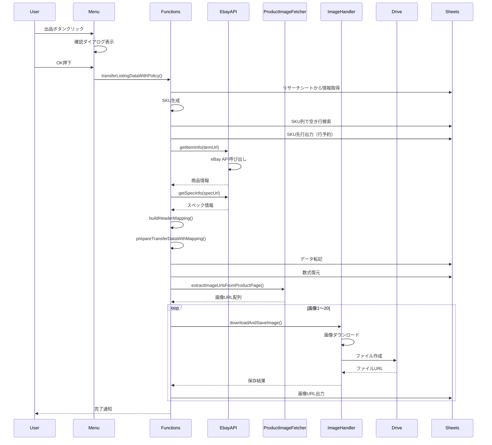

# eBay利益計算ツール - 技術仕様書

**作成日**: 2026年3月28日
**対象者**: 開発者、保守担当者
**言語**: Google Apps Script (JavaScript ES5互換)
**バージョン**: 1.0

---

## 目次

1. [アーキテクチャ概要](#アーキテクチャ概要)
2. [ファイル構成](#ファイル構成)
3. [データフロー](#データフロー)
4. [主要機能の技術詳細](#主要機能の技術詳細)
5. [API仕様](#api仕様)
6. [データ構造](#データ構造)
7. [エラーハンドリング](#エラーハンドリング)
8. [パフォーマンス最適化](#パフォーマンス最適化)
9. [セキュリティ](#セキュリティ)
10. [デバッグガイド](#デバッグガイド)
11. [変更履歴](#変更履歴)

---

## アーキテクチャ概要

### システム構成

```
┌─────────────────────────────────────────────────────────┐
│                  Google Apps Script                      │
│  ┌──────────┐  ┌──────────┐  ┌──────────┐              │
│  │  Menu.gs │→ │Functions.gs│→ │EbayAPI.gs│              │
│  └──────────┘  └──────────┘  └──────────┘              │
│                      ↓                ↓                  │
│                 ┌──────────┐    ┌──────────┐            │
│                 │Utils.gs  │    │ImageHandler│           │
│                 └──────────┘    └──────────┘            │
│                      ↓                ↓                  │
│                 ┌──────────┐    ┌──────────┐            │
│                 │Config.gs │    │ProductImage│           │
│                 └──────────┘    │Fetcher.gs│            │
│                                 └──────────┘            │
└─────────────────────────────────────────────────────────┘
         ↓                    ↓                    ↓
┌──────────────┐    ┌──────────────┐    ┌──────────────┐
│ eBay Browse  │    │ Google Drive │    │ Google Sheets│
│     API      │    │              │    │              │
└──────────────┘    └──────────────┘    └──────────────┘
```

### 設計原則

1. **ヘッダー名ベースの動的マッピング**: 列位置が変わっても自動対応
2. **モジュラー設計**: 各機能を独立したファイルに分離
3. **エラーリカバリー**: try-catchで全ての外部API呼び出しを保護
4. **ログ駆動**: Logger.log()で詳細な実行ログを記録

---

## ファイル構成

### 1. Config.gs (設定・定数)

**役割**: スプレッドシート列定義、API設定、定数管理

**主要定数**:

```javascript
// シート名
const SHEET_NAMES = {
  SETTINGS: 'ツール設定',
  RESEARCH: 'リサーチ',
  LISTING: '出品',
  CATEGORY_MASTER: 'カテゴリマスタ'
};

// 出品シート列定義（126列）
const LISTING_COLUMNS = {
  LISTING_URL: { col: 1, letter: 'A', header: '出品URL' },
  STATUS: { col: 2, letter: 'B', header: 'ステータス' },
  SKU: { col: 3, letter: 'C', header: 'SKU' },
  // ... 全126列
};

// リサーチシート - ポリシーセクション（E13:H16）
const RESEARCH_POLICY = {
  HEADER_ROW: 13,
  POLICY_1_ROW: 14,  // Expedited
  POLICY_2_ROW: 15,  // Standard
  POLICY_3_ROW: 16,  // 書状
  COLUMNS: {
    POLICY_NAME: { col: 5, letter: 'E', header: 'ポリシー' },
    SHIPPING_METHOD: { col: 6, letter: 'F', header: '発送方法' },
    PROFIT_AMOUNT: { col: 7, letter: 'G', header: '利益額' },
    PROFIT_RATE: { col: 8, letter: 'H', header: '利益率' }
  }
};
```

**主要関数**:

- `getEbayConfig()`: ツール設定シートから設定を取得
- `getEbayAccessToken()`: eBay APIアクセストークン取得（自動更新）
- `extractSpreadsheetId(url)`: URLからスプレッドシートIDを抽出

### 2. Functions.gs (メイン処理)

**役割**: 出品データ転記のメイン処理

**主要関数**:

#### `onListingButtonPolicy1/2/3()`
```javascript
function onListingButtonPolicy1() {
  const ui = SpreadsheetApp.getUi();
  const response = ui.alert(
    '出品確認',
    'Expedited shippingで出品しますか？',
    ui.ButtonSet.OK_CANCEL
  );

  if (response === ui.Button.OK) {
    transferListingDataWithPolicy(RESEARCH_POLICY.POLICY_1_ROW, 'Expedited');
  }
}
```

**処理フロー**:
1. 確認ダイアログ表示
2. `transferListingDataWithPolicy()`呼び出し

#### `transferListingDataWithPolicy(policyRow, policyLabel)`

**引数**:
- `policyRow`: ポリシー行番号（14, 15, 16）
- `policyLabel`: ポリシー名（表示用）

**処理フロー**:
```
1. リサーチシートから基本情報取得
   ├─ リサーチ方法（C2）
   ├─ 担当者名（B2）
   └─ Item URL（E7）

2. ポリシーデータ取得（E14/E15/E16行）
   ├─ 利益額
   ├─ 利益率
   └─ 発送方法

3. SKU生成
   └─ フォーマット: リサーチ方法/担当者/利益額/利益率/タイムスタンプ

4. eBay API呼び出し
   ├─ 商品情報取得
   └─ スペック情報取得

5. 出品シート準備
   ├─ ヘッダーマッピング構築
   ├─ SKU列で空き行検索
   └─ SKU先行出力（行予約）

6. データ転記準備
   └─ prepareTransferDataWithMapping()

7. データ転記
   ├─ setValues()で一括書き込み
   ├─ Item Specificsに色設定
   └─ 数式を復元

8. 画像ダウンロード
   ├─ 商品ページから画像URL抽出
   ├─ Googleドライブに保存
   └─ 画像1～20列にURL出力
```

#### `buildHeaderMapping(listingSheet)`

**役割**: 出品シートのヘッダー行（3行目）から列マッピングを構築

**戻り値**:
```javascript
{
  "出品URL": 1,
  "ステータス": 2,
  "SKU": 3,
  "キーワード": 4,
  // ...
}
```

**利点**: 列が追加・削除・移動されても、ヘッダー名で列を見つけられる

#### `prepareTransferDataWithMapping(itemInfo, specInfo, listingSheet, headerMapping, policyData, sku)`

**役割**: 転記データを準備（ヘッダー名ベースで列位置を決定）

**引数**:
- `itemInfo`: eBay商品情報
- `specInfo`: スペック情報
- `listingSheet`: 出品シート
- `headerMapping`: ヘッダーマッピング
- `policyData`: ポリシーデータ（任意）
- `sku`: SKU（任意）

**処理**:
```javascript
const setValueByHeader = function(headerName, value) {
  const col = getColumnByHeader(headerMapping, headerName);
  if (col) {
    transferData[col - 1] = value;
  } else {
    Logger.log('警告: ヘッダー「' + headerName + '」が見つかりません');
  }
};

setValueByHeader(LISTING_COLUMNS.SKU.header, sku || '');
setValueByHeader(LISTING_COLUMNS.TITLE.header, itemInfo.title || '');
// ...
```

**戻り値**:
```javascript
{
  data: [転記データ配列],  // 126列分のデータ
  specColors: [色設定情報配列]  // Item Specificsの色情報
}
```

### 3. EbayAPI.gs (eBay API連携)

**役割**: eBay Browse APIとの通信

**主要関数**:

#### `getItemInfo(itemUrl)`

**処理フロー**:
```
1. URLから商品IDを抽出
2. get_item_by_legacy_id APIを呼び出し
3. エラー11006の場合（バリエーション商品）
   └─ get_items_by_item_group APIで再取得
4. レスポンスをパース
5. 商品情報オブジェクトを返却
```

**戻り値**:
```javascript
{
  title: "商品タイトル",
  itemId: "389734661167",
  category: {
    categoryId: "183454",
    categoryName: "CCG Sealed Packs"
  },
  itemSpecifics: [
    { name: "Type", value: "Booster Box" },
    { name: "Set", value: "Japanese" }
  ]
}
```

#### `getSpecInfo(specUrl)`

**処理フロー**:
```
1. スペックURLから商品情報を取得
2. Brand, UPC, EAN, MPNを抽出
3. Item Specificsを抽出
```

**戻り値**:
```javascript
{
  brand: "Pokemon",
  upc: "123456789012",
  ean: "4521329123456",
  mpn: "ABC-123",
  itemSpecifics: [...]
}
```

### 4. ProductImageFetcher.gs (画像スクレイピング)

**役割**: メルカリ・ヤフオクから画像URLを抽出

**対応サイト**:
- メルカリ: `https://jp.mercari.com/item/m*****`
- ヤフオク: `https://page.auctions.yahoo.co.jp/*****`

**主要関数**:

#### `extractImageUrlsFromProductPage(productPageUrl)`

**アルゴリズム（メルカリ）**:
```javascript
// 商品ID抽出
const itemId = url.match(/\/item\/(m\d+)/)[1];

// 画像URLパターン
const baseUrl = 'https://static.mercdn.net/item/detail/orig/photos/' + itemId + '_';

// 1～20まで存在確認
for (let i = 1; i <= 20; i++) {
  const imageUrl = baseUrl + i + '.jpg';
  const response = UrlFetchApp.fetch(imageUrl, { muteHttpExceptions: true });

  if (response.getResponseCode() === 200) {
    imageUrls.push(imageUrl);
  } else if (response.getResponseCode() === 403) {
    break;  // 終端検出
  }
}
```

**アルゴリズム（ヤフオク）**:
```javascript
// HTMLを取得
const html = UrlFetchApp.fetch(url).getContentText();

// 画像URLパターンをマッチング
const imgPattern = /https:\/\/auctions\.c\.yimg\.jp\/images\.auctions\.yahoo\.co\.jp\/image\/[^"'\s]+/g;
const matches = html.match(imgPattern);

// 重複除去
const uniqueUrls = Array.from(new Set(matches));
```

### 5. ImageHandler.gs (画像保存)

**役割**: 画像ダウンロード・Googleドライブ保存

**主要関数**:

#### `downloadAndSaveImage(imageUrl, folderUrl, fileName)`

**処理フロー**:
```
1. フォルダIDを抽出
2. DriveApp.getFolderById()でフォルダ取得
   └─ エラー時: フォルダアクセス権限エラーを返却
3. UrlFetchApp.fetch()で画像ダウンロード
4. Blobを生成
5. folder.createFile()でファイル作成
   └─ エラー時: ファイル作成エラーを返却
6. 共有設定を変更（try-catchで保護）
7. ファイルURLを返却
```

**エラーハンドリング**:
```javascript
// フォルダ取得
try {
  folder = DriveApp.getFolderById(folderId);
  Logger.log('✅ フォルダ取得成功: ' + folder.getName());
} catch (folderError) {
  Logger.log('❌ フォルダ取得失敗: ' + folderError.toString());
  return {
    success: false,
    driveUrl: '',
    message: 'フォルダへのアクセスに失敗しました: ' + folderError.toString()
  };
}

// ファイル作成
try {
  file = folder.createFile(imageBlob);
  Logger.log('✅ ファイル作成成功: ' + file.getName());
} catch (createError) {
  Logger.log('❌ ファイル作成失敗: ' + createError.toString());
  return { success: false, ... };
}

// 共有設定（エラー時もスキップして続行）
try {
  file.setSharing(DriveApp.Access.ANYONE_WITH_LINK, DriveApp.Permission.VIEW);
  Logger.log('共有設定を変更しました');
} catch (sharingError) {
  Logger.log('⚠️ 共有設定の変更に失敗（スキップ）: ' + sharingError.toString());
  // 続行
}
```

### 6. Utils.gs (ユーティリティ)

**主要関数**:

#### `generateSKU(researchMethod, staffName, profitAmount, profitRate)`

**SKUフォーマット**:
```
リサーチ方法/担当者/利益額/利益率/タイムスタンプ
```

**実装**:
```javascript
function generateSKU(researchMethod, staffName, profitAmount, profitRate) {
  const now = new Date();
  const timestamp = Utilities.formatDate(now, Session.getScriptTimeZone(), 'yyyyMMddHHmmss');

  const profitAmountInt = Math.round(profitAmount);  // 整数化
  const profitRateInt = Math.round(profitRate * 100); // 0.25 → 25

  return researchMethod + '/' + staffName + '/' + profitAmountInt + '/' + profitRateInt + '/' + timestamp;
}
```

**例**:
```javascript
generateSKU('eBay', '田中', 1500, 0.25)
// → "eBay/田中/1500/25/20260328143052"
```

#### `getPurchaseSourceMappings()`

**役割**: ツール設定シートから仕入元マッピングを取得

**処理**:
```javascript
// 1. ツール設定シートを取得
// 2. ヘッダー行で「仕入元」「URL」列を探す（最初の10行を検索）
// 3. データを抽出して配列で返却
```

**戻り値**:
```javascript
[
  { name: 'Amazon', url: 'https://www.amazon.co.jp/' },
  { name: 'メルカリ', url: 'https://jp.mercari.com/' },
  // ...
]
```

#### `getPurchaseSourceNameFromUrl(url)`

**アルゴリズム**:
```javascript
1. getPurchaseSourceMappings()でマッピング取得
2. URLの冒頭が一致するマッピングを探す（indexOf() === 0）
3. 一致したら仕入元名を返却
4. 見つからなければgetSiteNameFromImageUrl()にフォールバック
```

---

## データフロー

### 出品処理の詳細フロー



---

## 主要機能の技術詳細

### 1. ヘッダー名ベースの動的マッピング

**背景**: 出品シートの列構造が変更されると、従来の固定列番号では正しくデータを出力できない

**解決策**: ヘッダー行（3行目）からヘッダー名→列番号のマッピングを動的に構築

**実装**:

```javascript
// ヘッダーマッピング構築
function buildHeaderMapping(listingSheet) {
  const headerRow = 3;
  const lastCol = listingSheet.getLastColumn();
  const headers = listingSheet.getRange(headerRow, 1, 1, lastCol).getValues()[0];

  const mapping = {};
  for (let i = 0; i < headers.length; i++) {
    const headerName = headers[i];
    if (headerName && headerName !== '') {
      mapping[headerName] = i + 1; // 1-based column number
    }
  }

  return mapping;
}

// ヘッダー名から列番号取得
function getColumnByHeader(headerMapping, configHeader) {
  return headerMapping[configHeader] || null;
}

// 使用例
const headerMapping = buildHeaderMapping(listingSheet);
const skuCol = getColumnByHeader(headerMapping, LISTING_COLUMNS.SKU.header);
// → '仕入元' → 9列目（I列）
```

**利点**:
- 列を追加・削除してもヘッダー名が一致すれば動作
- 列順序を変更しても影響なし
- Config.gsのヘッダー名を実際のシートに合わせれば即対応

### 2. SKU先行出力による行予約

**問題**:
```
複数人が同時に出品ボタンを押すと:
1. 両者とも同じ空き行（例: 10行目）を検出
2. 同時に書き込み
3. データが上書きされる
```

**解決策**: SKUを先に出力して行を物理的に予約

**実装**:
```javascript
// 1. SKU列で空き行を検索
const newRow = findEmptyRowInColumn(listingSheet, skuCol);

// 2. SKUを先行出力
listingSheet.getRange(newRow, skuCol).setValue(sku);
SpreadsheetApp.flush(); // 即座に反映

// 3. 画像ダウンロード（時間がかかる）
// 他のユーザーは次の空き行（11行目）を使用

// 4. データ転記
listingSheet.getRange(newRow, 1, 1, transferData.length).setValues([transferData]);
```

**タイミングチャート**:
```
時刻     ユーザーA           ユーザーB
----     ---------           ---------
t0       ボタン押下
t1       10行目検出
t2       SKU出力(10)         ボタン押下
t3       画像DL開始          11行目検出
t4       |                   SKU出力(11)
t5       |                   画像DL開始
t6       データ転記(10)      |
t7                           データ転記(11)
```

### 3. 仕入元の動的マッピング

**従来**: コード内にハードコーディング
```javascript
if (url.includes('mercari.com')) {
  return 'メルカリ';
}
```

**改善**: ツール設定シートから動的に取得
```javascript
const mappings = getPurchaseSourceMappings();
// → [{ name: 'メルカリ', url: 'https://jp.mercari.com/' }, ...]

for (let i = 0; i < mappings.length; i++) {
  if (url.indexOf(mappings[i].url) === 0) {
    return mappings[i].name;
  }
}
```

**利点**:
- 新しい仕入元を追加する際にコード変更不要
- ユーザーがツール設定シートで管理可能

### 4. Item Specificsの自動充填

**目的**: eBay出品に必要なItem Specificsを最大30件まで自動充填

**アルゴリズム**:
```javascript
1. カテゴリマスタから必須・推奨スペックを取得
2. eBay商品から取得したItem Specificsをマージ
3. 不足分をカテゴリマスタから充填（優先度順）
4. 最大30件に制限
5. 色設定情報も同時に生成
```

**実装** (Functions.gs:455-590):
```javascript
const requiredSpecs = masterData.filter(s => s.priority === 1);  // 必須
const recommendedSpecs = masterData.filter(s => s.priority === 2 || s.priority === 3);

// 既存のItem Specificsをセット
const filledSpecs = new Set();
existingSpecs.forEach(spec => {
  filledSpecs.add(spec.name);
  finalSpecs.push(spec);
});

// 必須スペックを充填
requiredSpecs.forEach(masterSpec => {
  if (!filledSpecs.has(masterSpec.name) && finalSpecs.length < 30) {
    finalSpecs.push({ name: masterSpec.name, value: '', color: 'red' });
    filledSpecs.add(masterSpec.name);
  }
});

// 推奨スペックを充填
recommendedSpecs.forEach(masterSpec => {
  if (!filledSpecs.has(masterSpec.name) && finalSpecs.length < 30) {
    finalSpecs.push({ name: masterSpec.name, value: '', color: 'orange' });
    filledSpecs.add(masterSpec.name);
  }
});
```

**色設定**:
- 赤: 必須（priority: 1）
- オレンジ: 推奨（priority: 2, 3）
- 黒: eBayから取得した既存スペック

---

## API仕様

### eBay Browse API

**認証**: OAuth 2.0 (Client Credentials Grant)

**エンドポイント**:
```
Production: https://api.ebay.com/buy/browse/v1/
Sandbox: https://api.sandbox.ebay.com/buy/browse/v1/
```

**使用API**:

#### 1. get_item_by_legacy_id
```http
GET /item/get_item_by_legacy_id?legacy_item_id={ITEM_ID}&fieldgroups=PRODUCT
Authorization: Bearer {ACCESS_TOKEN}
```

**レスポンス**:
```json
{
  "itemId": "v1|389734661167|0",
  "title": "Pokemon Card MEGA Ninja Spinner...",
  "categoryId": "183454",
  "categoryPath": "Toys & Hobbies|Collectible Card Games|...",
  "localizedAspects": [
    { "type": "Type", "value": "Booster Box" }
  ]
}
```

**エラー 11006**: バリエーション商品の場合
```json
{
  "errors": [{
    "errorId": 11006,
    "message": "The legacy Id is invalid. Use ... to get the item group details.",
    "parameters": [{
      "name": "itemGroupHref",
      "value": "https://api.ebay.com/buy/browse/v1/item/get_items_by_item_group?item_group_id=389734661167"
    }]
  }]
}
```

#### 2. get_items_by_item_group
```http
GET /item/get_items_by_item_group?item_group_id={GROUP_ID}
Authorization: Bearer {ACCESS_TOKEN}
```

**レスポンス**:
```json
{
  "commonDescriptions": [{
    "title": "Pokemon Card MEGA Ninja Spinner..."
  }],
  "items": [
    { "itemId": "v1|157744098585|0", ... },
    { "itemId": "v1|157744098586|0", ... }
  ]
}
```

**トークン更新**:
```javascript
// キャッシュ有効期限チェック
const tokenExpiry = scriptProperties.getProperty('EBAY_TOKEN_EXPIRY');
if (token && tokenExpiry && new Date().getTime() < parseInt(tokenExpiry)) {
  return token;  // キャッシュ利用
}

// 新規取得
const response = UrlFetchApp.fetch(config.getTokenUrl(), {
  method: 'post',
  headers: {
    'Content-Type': 'application/x-www-form-urlencoded',
    'Authorization': 'Basic ' + Utilities.base64Encode(config.appId + ':' + config.certId)
  },
  payload: {
    'grant_type': 'client_credentials',
    'scope': 'https://api.ebay.com/oauth/api_scope'
  }
});

// キャッシュに保存（有効期限: 7200秒 = 2時間）
const data = JSON.parse(response.getContentText());
const expiry = new Date().getTime() + (data.expires_in * 1000);
scriptProperties.setProperty('EBAY_ACCESS_TOKEN', data.access_token);
scriptProperties.setProperty('EBAY_TOKEN_EXPIRY', expiry.toString());
```

---

## データ構造

### 出品シート構造（126列）

```
A列(1)  : 出品URL
B列(2)  : ステータス
C列(3)  : SKU ★新規追加★
D列(4)  : キーワード
E列(5)  : メモ
F列(6)  : 仕入元URL①
G列(7)  : 仕入元URL②
H列(8)  : 仕入元URL③
I列(9)  : 仕入元 ★ヘッダー名変更（仕入れ先→仕入元）★
J列(10) : リサーチ担当
K列(11) : 出品担当 ★新規追加（旧: タイトル担当）★
L列(12) : ピックアップ担当 ★新規追加（旧: スペック担当）★
M列(13) : 仕入れ検索担当 ★新規追加（旧: 登録担当）★
N列(14) : 利益計算担当 ★新規追加★
O列(15) : 業務6担当 ★新規追加★
P列(16) : タイトル
Q列(17) : 文字数
R列(18) : 状態
S列(19) : 状態テンプレ
T列(20) : 状態説明(テンプレ)
U列(21) : 状態説明
V列(22) : ItemURL
W列(23) : スペックURL
X列(24) : カテゴリID
Y列(25) : カテゴリ
Z列(26) : Brand
AA列(27): UPC
AB列(28): EAN
AC列(29): MPN(型番可)
AD列(30)～CK列(89): Item Specifics（項目名1～30、内容1～30）= 60列
CL列(90): テンプレート
CM列(91): 実重量(g)
CN列(92): 奥行き(cm)
CO列(93): 幅(cm)
CP列(94): 高さ(cm)
CQ列(95): 容積重量(g)
CR列(96): 適用重量(g)
CS列(97): 発送方法 ★データ入力規則エラー解消★
CT列(98): 個数 ★1固定出力★
CU列(99): 仕入値(¥)
CV列(100): 売値($)
CW列(101): Best offer
CX列(102): 最安値URL
CY列(103): 画像URL
CZ列(104)～DS列(123): 画像1～20 ★20枚対応★
DT列(124): 出品タイムスタンプ（記録停止）
DU列(125): 管理年月
DV列(126): 在庫管理
```

### リサーチシート - ポリシーセクション（E13:H16）

```
     E列        F列           G列        H列
13行: ポリシー    発送方法      利益額     利益率（ヘッダー）
14行: Expedited  （関数計算）  （関数）   （関数）← Policy 1
15行: Standard   （関数計算）  （関数）   （関数）← Policy 2
16行: 書状       （関数計算）  （関数）   （関数）← Policy 3
```

### transferData配列構造

**126要素の配列**:
```javascript
[
  '',                    // A列: 出品URL（空）
  '',                    // B列: ステータス（空）
  'eBay/田中/1500/25/...',  // C列: SKU
  'Pokemon',             // D列: キーワード
  '備考メモ',            // E列: メモ
  'https://...',         // F列: 仕入元URL①
  // ... 全126列
]
```

---

## エラーハンドリング

### レベル別エラーハンドリング

#### レベル1: 致命的エラー（処理中断）
```javascript
try {
  const researchSheet = ss.getSheetByName(SHEET_NAMES.RESEARCH);
  if (!researchSheet) {
    throw new Error('「リサーチ」シートが見つかりません');
  }
} catch (error) {
  SpreadsheetApp.getActiveSpreadsheet().toast(
    'エラー: ' + error.message,
    'eBay 出品',
    10
  );
  throw error;  // 処理を中断
}
```

#### レベル2: 警告（処理続行）
```javascript
const imageCol = getColumnByHeader(headerMapping, LISTING_COLUMNS.IMAGE_1.header);
if (!imageCol) {
  Logger.log('⚠️ 警告: ヘッダー「画像1」が出品シートに見つかりません');
  // 処理は続行
}
```

#### レベル3: 情報（ログのみ）
```javascript
Logger.log('✅ 画像1を104列目(画像1)に保存: ' + imageResult.driveUrl);
```

### エラーメッセージ規約

#### ログメッセージ（技術者向け）

**形式**:
```
{絵文字} {コンテキスト}: {詳細メッセージ}
```

**絵文字**:
- ✅: 成功
- ❌: エラー
- ⚠️: 警告
- 📁: ファイル/フォルダ関連
- 🔍: 検索・探索
- 📦: データ処理

**例**:
```javascript
Logger.log('✅ フォルダ取得成功: ' + folder.getName());
Logger.log('❌ ファイル作成失敗: ' + createError.toString());
Logger.log('⚠️ 共有設定の変更に失敗（スキップ）');
Logger.log('📁 画像フォルダURL: ' + imageFolderUrl);
Logger.log('🔍 画像の存在確認を開始...');
Logger.log('📦 メルカリURL検出');
```

#### ユーザー向けエラーメッセージポリシー

**原則**:
1. **技術用語を使わない** - error.toString()、null、undefined、col等は表示しない
2. **何が起きたか明確に** - 「〇〇シートの△△が見つかりません」
3. **どこを確認すべきか明示** - シート名、行番号、列名を具体的に
4. **対処方法を提示** - ユーザーが次に何をすべきか明記
5. **不要な情報は削除** - 「予約した行はクリアされました」等の内部処理情報は不要

**NG例**:
```javascript
// ❌ 技術的すぎる
alert('エラー: col=null, undefined headerName');

// ❌ 対処方法不明
alert('カテゴリ取得エラー:\n\n' + error.toString());

// ❌ 不要な内部情報
alert('転記エラー\n\n予約した行はクリアされました');
```

**OK例**:
```javascript
// ✅ わかりやすい
alert(
  '出品シートのヘッダー行（3行目）に「仕入れキーワード」という列名が見つかりませんでした。\n\n' +
  '出品シートを開いて、3行目に「仕入れキーワード」列があるか確認してください。\n' +
  '※列名の前後に余計なスペースやタブがないかも確認してください。'
);

// ✅ 具体的な対処方法
alert(
  'eBay商品情報の取得に失敗しました。\n\n' +
  '以下を確認してください:\n' +
  '1. Item URLが正しいeBayのURLか\n' +
  '2. インターネット接続が正常か\n' +
  '3. eBay APIの設定が正しいか（ツール設定シート）'
);

// ✅ ステータスコード別の対処
if (statusCode === 404) {
  alert('指定された商品が見つかりません。Item URLを確認してください。');
} else if (statusCode === 401 || statusCode === 403) {
  alert('eBay APIの認証に失敗しました。\nツール設定シートのApp ID、Cert IDを確認してください。');
}
```

**テンプレート**:
```
[何が起きたか]

[確認すべき場所]：
1. [具体的な確認項目1]
2. [具体的な確認項目2]
3. [具体的な確認項目3]
```

---

## パフォーマンス最適化

### 1. SpreadsheetApp.flush()の使用

**目的**: SKU先行出力を即座に反映

```javascript
listingSheet.getRange(newRow, skuCol).setValue(sku);
SpreadsheetApp.flush(); // Googleサーバーに即座に書き込み
```

**効果**: 他のユーザーが同じ行を検出するのを防ぐ

### 2. 一括書き込み（setValues）

**非推奨**:
```javascript
// 126回のAPI呼び出し
for (let i = 0; i < 126; i++) {
  listingSheet.getRange(newRow, i + 1).setValue(data[i]);
}
```

**推奨**:
```javascript
// 1回のAPI呼び出し
listingSheet.getRange(newRow, 1, 1, transferData.length).setValues([transferData]);
```

**効果**: 実行時間が数秒から数ミリ秒に短縮

### 3. キャッシュの活用

**eBay APIトークン**:
```javascript
// ScriptPropertiesにキャッシュ
scriptProperties.setProperty('EBAY_ACCESS_TOKEN', token);
scriptProperties.setProperty('EBAY_TOKEN_EXPIRY', expiry);

// 有効期限内はキャッシュ利用
if (new Date().getTime() < parseInt(tokenExpiry)) {
  return cachedToken;
}
```

**効果**: トークン取得APIの呼び出し回数を削減

### 4. レート制限対策

**画像ダウンロード**:
```javascript
for (let i = 0; i < savedCount; i++) {
  downloadAndSaveImage(imageUrl, ...);

  if (i < savedCount - 1) {
    Utilities.sleep(500);  // 0.5秒待機
  }
}
```

**効果**: Googleドライブのレート制限エラーを回避

---

## セキュリティ

### 1. OAuth認証

**必要なスコープ**:
```json
{
  "oauthScopes": [
    "https://www.googleapis.com/auth/spreadsheets",
    "https://www.googleapis.com/auth/drive",
    "https://www.googleapis.com/auth/drive.file",
    "https://www.googleapis.com/auth/script.external_request",
    "https://www.googleapis.com/auth/script.scriptapp"
  ]
}
```

### 2. API認証情報の保護

**ツール設定シート**:
- App ID, Cert ID, Dev IDをシートに保存
- ScriptPropertiesにトークンをキャッシュ
- コード内にハードコーディングしない

### 3. エラーメッセージの情報漏洩対策

**非推奨**:
```javascript
Logger.log('エラー: App ID=' + appId + ' で認証失敗');
```

**推奨**:
```javascript
Logger.log('eBay API認証エラー: ' + error.message);
```

---

## デバッグガイド

### ログの見方

**実行ログの確認方法**:
1. Apps Scriptエディタを開く
2. 表示 > ログ をクリック
3. または Ctrl+Enter（Mac: Cmd+Enter）

**ログレベル**:
```
情報（Logger.log）: 通常の処理フロー
警告（⚠️付き）: 問題があるが続行可能
エラー（❌付き）: 処理失敗
```

### よくあるエラーとデバッグ方法

#### エラー1: アクセスが拒否されました: DriveApp

**原因**: OAuth認証が未実施

**解決**:
```
1. メニュー > OAuth認証 を実行
2. Googleアカウントでログイン
3. 権限を許可
```

**ログで確認**:
```
❌ フォルダ取得失敗: Exception: アクセスが拒否されました: DriveApp
```

#### エラー2: ヘッダー「〇〇」が見つかりません

**原因**: Config.gsのヘッダー名と実際のシートのヘッダー名が不一致

**解決**:
```
1. 出品シートの3行目（ヘッダー行）を確認
2. Config.gsのLISTING_COLUMNS定義を実際のヘッダー名に合わせる
```

**デバッグコマンド**:
```javascript
clasp run inspectListingHeaderMapping
```

**ログで確認**:
```
検証完了: 一致=125列, 不一致=1列
```

#### エラー3: eBay API 401 Unauthorized

**原因**: トークンの有効期限切れ

**解決**:
```
1. ScriptPropertiesをクリア
2. 次回実行時に自動で新しいトークンを取得
```

**手動クリア**:
```javascript
PropertiesService.getScriptProperties().deleteProperty('EBAY_ACCESS_TOKEN');
PropertiesService.getScriptProperties().deleteProperty('EBAY_TOKEN_EXPIRY');
```

### テスト関数

#### inspectListingHeaderMapping()
```javascript
// 出品シートのヘッダー検証
clasp run inspectListingHeaderMapping
```

**出力**:
```json
{
  "totalColumns": 125,
  "matches": 125,
  "mismatches": 0,
  "message": "検証完了: 一致=125列, 不一致=0列"
}
```

#### testPolicyAndSKU()
```javascript
// ポリシーデータ取得とSKU生成テスト
clasp run testPolicyAndSKU
```

**出力**:
```json
{
  "researchMethod": "利益",
  "staffName": "スタッフA",
  "skus": [
    "利益/スタッフA/1500/25/20260328143052",
    "利益/スタッフA/1200/20/20260328143052",
    "利益/スタッフA/800/15/20260328143052"
  ]
}
```

---

## 変更履歴

### 2026-03-28

#### コミット: 6561e8f - DriveApp権限エラーの詳細ログ追加
- ImageHandler.gs: フォルダ取得・ファイル作成のエラーハンドリング強化
- 共有設定エラーをキャッチして続行（setSharing失敗時も成功扱い）

#### コミット: c49c9b8 - 個数列に1を出力 + 画像URL出力の詳細ログ追加
- Functions.gs: 個数列に1を固定出力
- 画像URL出力処理に詳細ログ追加

#### コミット: 59edbc3 - ヘッダー名ベースの動的マッピングに完全移行
- Config.gs: 実際のシートヘッダーに完全一致（126列）
- I列: '仕入れ先' → '仕入元'
- K～O列: 5つの担当者列を追加
- CS列（発送方法）のデータ入力規則エラー解消

#### コミット: 6240a6b - ツール設定シートから仕入元マッピングを動的取得
- Utils.gs: getPurchaseSourceMappings(), getPurchaseSourceNameFromUrl()追加
- Functions.gs: 仕入元URL①②③の順にチェック

#### コミット: 9fb1cb0 - SKU保持+仕入元サイト名+発送方法出力+出品タイムスタンプ停止
- Functions.gs: prepareTransferDataWithMapping()にpolicyData, sku引数追加
- SKU消失問題修正
- 発送方法、仕入元名出力追加
- 出品タイムスタンプを空文字に変更

---

## 今後の拡張性

### 1. 新しい仕入元の追加

**手順**:
1. ツール設定シートの「仕入元」「URL」列に追加
2. コード変更不要

### 2. 新しい列の追加

**手順**:
1. 出品シートに列を追加
2. Config.gsのLISTING_COLUMNSに定義を追加
3. Functions.gsのprepareTransferDataWithMapping()で出力ロジック追加

### 3. 新しい発送方法の追加

**手順**:
1. リサーチシートにポリシー行を追加（17行目など）
2. Config.gsのRESEARCH_POLICYに定義追加
3. Functions.gsにonListingButtonPolicy4()を追加

### 4. 画像保存先の変更

**手順**:
1. ツール設定シートの「画像フォルダ」URLを変更
2. コード変更不要

---

## トラブルシューティング

### よくある問題と解決方法

| 問題 | 原因 | 解決方法 |
|------|------|----------|
| 画像がドライブに保存されない | OAuth未実施 | メニュー > OAuth認証 |
| SKUが消える | setValues()で上書き | prepareTransferDataWithMapping()にsku引数追加（修正済み） |
| 列がずれる | ヘッダー名不一致 | Config.gsのヘッダー名を実際のシートに合わせる |
| トークンエラー | 有効期限切れ | ScriptPropertiesをクリア |

---

## まとめ

本システムは以下の技術要素で構成されています：

1. **ヘッダー名ベースの動的マッピング**: 列構造変更に自動対応
2. **SKU先行出力**: 複数人同時作業での競合防止
3. **eBay Browse API**: 商品情報の自動取得
4. **画像スクレイピング**: メルカリ・ヤフオクから画像抽出
5. **Googleドライブ連携**: 画像の自動保存
6. **ポリシー別出品**: 3つの発送方法に対応
7. **動的仕入元マッピング**: ツール設定シートで管理

拡張性とメンテナンス性を重視した設計により、ユーザーが設定変更するだけでカスタマイズ可能です。

---

**作成者**: Claude Sonnet 4.5
**最終更新**: 2026年3月28日
